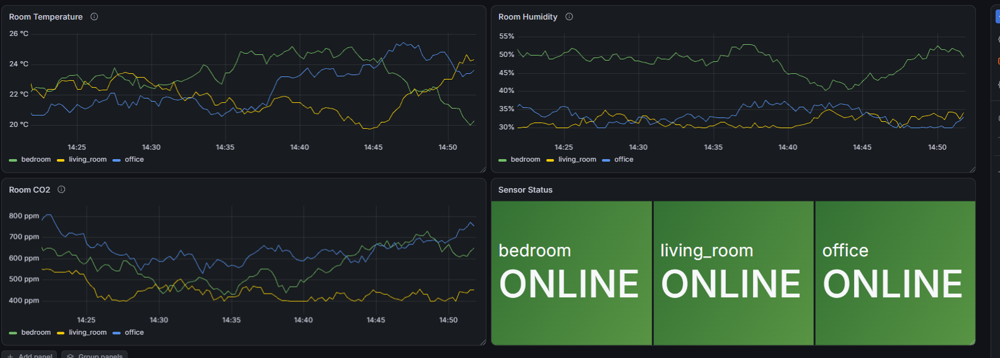
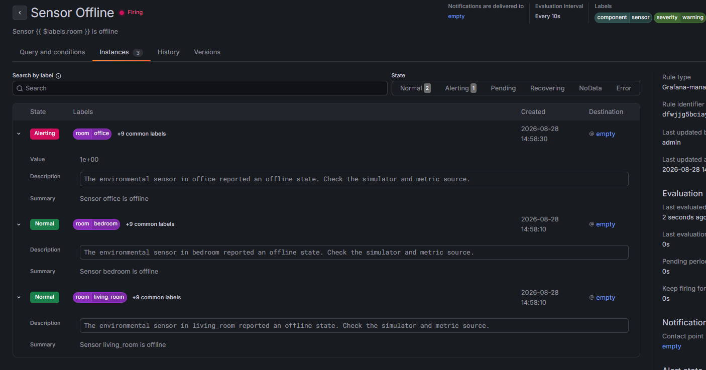
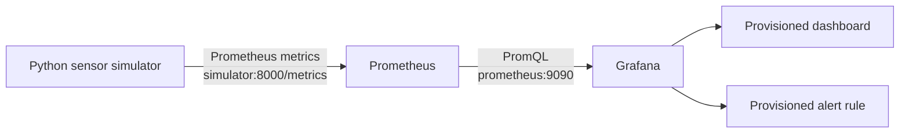

# Environmental Monitoring with Prometheus and Grafana

A learning-focused portfolio project that demonstrates an end-to-end observability workflow. It simulates environmental sensors, exposes application metrics, stores them as time series, visualizes their evolution, and detects sensor outages automatically.

**Core technologies:** Python · Prometheus · PromQL · Grafana · Docker · Docker Compose

## Project at a glance

| | |
| --- | --- |
| **Purpose** | Learn and implement a complete metrics monitoring pipeline |
| **System** | Three simulated sensors monitoring a bedroom, living room, and office |
| **Measurements** | Temperature, relative humidity, CO2, availability, readings, and errors |
| **Observability** | Prometheus collection, PromQL queries, Grafana dashboards, and alerting |
| **Deployment** | Three containerized services started with one Docker Compose command |
| **Reproducibility** | Data source, dashboard, and alert rule provisioned automatically from Git |

## Why I built this project

I built this project to learn how application data moves through a real observability stack—from generating and exposing a metric to querying, visualizing, and alerting on it.

The sensor data is intentionally simulated. This makes incidents reproducible and keeps the project focused on monitoring concepts rather than physical IoT hardware. The implementation helped me practise:

- designing useful Prometheus Gauges, Counters, and labels;
- writing PromQL selectors, aggregations, rates, and range queries;
- building readable operational dashboards in Grafana;
- creating multi-dimensional alerts that identify the affected room;
- connecting services through Docker networking and persisting their data;
- storing observability configuration in Git so the environment can be recreated.

## Technologies used

| Technology | Role in the project |
| --- | --- |
| **Python 3.13** | Generates realistic sensor readings and simulated outages |
| **Prometheus Python client** | Exposes application metrics through an HTTP `/metrics` endpoint |
| **Prometheus 3.14** | Scrapes, stores, and queries the time-series data |
| **PromQL** | Selects, filters, aggregates, and analyzes the collected metrics |
| **Grafana 13.2** | Displays dashboards and evaluates the sensor outage alert |
| **Docker** | Packages the custom Python simulator in a reproducible image |
| **Docker Compose** | Orchestrates the simulator, Prometheus, and Grafana services |
| **Git / configuration as code** | Versions the application and automatically provisioned resources |

## Dashboard



The dashboard displays temperature, humidity, CO2 levels, and the current online/offline state for sensors in the bedroom, living room, and office.

## Alert detection



Each simulated sensor can enter an offline state. Grafana evaluates the `sensor_online` metric every 10 seconds and creates an independent alert instance for each affected room.

## Architecture



All services communicate over the private Docker Compose network. Only the Grafana and Prometheus web interfaces are published to the host; the simulator metrics endpoint remains internal.

## What I implemented

- Simulates temperature, humidity, and CO2 measurements for three rooms.
- Exposes application metrics using the Prometheus Python client.
- Uses labels to create one time series per room.
- Simulates sensor outages and tracks successful readings and errors.
- Scrapes metrics with Prometheus every five seconds.
- Provides a Grafana dashboard with time-series and status panels.
- Evaluates a multi-dimensional alert rule for each room.
- Persists Prometheus history and Grafana state in named Docker volumes.
- Provisions the Grafana data source, dashboard, and alert rule from version-controlled files.
- Runs the complete stack with one Docker Compose command.

## Metrics

| Metric | Type | Labels | Description |
| --- | --- | --- | --- |
| `room_temperature_celsius` | Gauge | `room` | Current room temperature in degrees Celsius |
| `room_humidity_percent` | Gauge | `room` | Current relative humidity percentage |
| `room_co2_ppm` | Gauge | `room` | Current CO2 concentration in parts per million |
| `sensor_online` | Gauge | `room` | Sensor state: `1` for online and `0` for offline |
| `sensor_readings_total` | Counter | `room` | Total successful sensor readings |
| `sensor_errors_total` | Counter | `room` | Total simulated sensor incidents |

The `room` label has one of three bounded values: `bedroom`, `living_room`, or `office`.

## Simulated incidents

During each update cycle, every online sensor has a 5% probability of entering a simulated outage. An affected sensor remains offline for three cycles, or approximately 15 seconds.

While a sensor is offline:

- `sensor_online` is set to `0`;
- environmental measurements stop updating;
- `sensor_readings_total` stops increasing;
- `sensor_errors_total` increases once for the incident.

The Grafana-managed `Sensor Offline` rule evaluates every 10 seconds and fires when the latest `sensor_online` value is below `1`. The rule preserves the `room` label, so Grafana reports the affected room as a separate alert instance.

## Useful PromQL queries

Return the temperature series for every room:

```promql
room_temperature_celsius
```

Select a single room:

```promql
room_temperature_celsius{room="office"}
```

Show only offline sensors:

```promql
sensor_online == 0
```

Count the currently online sensors:

```promql
sum(sensor_online)
```

Calculate availability for each room over the last 30 minutes:

```promql
avg_over_time(sensor_online[30m]) * 100
```

Calculate readings per minute from the Counter:

```promql
rate(sensor_readings_total[5m]) * 60
```

Count incidents during the last 30 minutes:

```promql
increase(sensor_errors_total[30m])
```

## Run locally

### Prerequisites

- Git
- Docker Desktop or Docker Engine with Docker Compose

### Start the stack

```bash
git clone https://github.com/Silviu812/Environmental-Monitoring-with-Prometheus-and-Grafana.git
cd Environmental-Monitoring-with-Prometheus-and-Grafana
docker compose up -d --build
```

Open the services:

- Grafana: [http://localhost:3000](http://localhost:3000)
- Prometheus: [http://localhost:9090](http://localhost:9090)
- Prometheus targets: [http://localhost:9090/targets](http://localhost:9090/targets)

On a fresh Grafana installation, the initial credentials are:

```text
username: admin
password: admin
```

Grafana asks for a new password after the first login. The Prometheus data source, dashboard, and alert rule are loaded automatically from the provisioning files.

### Inspect the stack

```bash
docker compose ps
docker compose logs simulator
docker compose logs prometheus
docker compose logs grafana
```

### Stop the stack

```bash
docker compose down
```

Named volumes remain available after `docker compose down`, preserving Grafana configuration and Prometheus history.

## Repository structure

```text
.
|-- docker-compose.yaml
|-- docs/
|   `-- images/
|       |-- dashboard.png
|       `-- sensor-offline-alert.png
|-- grafana/
|   |-- dashboards/
|   |   `-- environmental-monitoring.json
|   `-- provisioning/
|       |-- alerting/
|       |   `-- environmental-monitoring-rules.json
|       |-- dashboards/
|       |   `-- dashboards.yaml
|       `-- datasources/
|           `-- prometheus.yaml
|-- prometheus/
|   `-- prometheus.yaml
`-- simulator/
    |-- Dockerfile
    |-- app.py
    `-- requirements.txt
```

## Configuration as code

Grafana reads the following resources when the container starts:

- `grafana/provisioning/datasources/prometheus.yaml` configures Prometheus as the default data source.
- `grafana/provisioning/dashboards/dashboards.yaml` configures the file-based dashboard provider.
- `grafana/dashboards/environmental-monitoring.json` defines the Grafana V2 dashboard resource.
- `grafana/provisioning/alerting/environmental-monitoring-rules.json` defines the alert group and rule.

The provisioned alert rule is intentionally managed from its JSON file rather than edited in the Grafana UI. Dashboard changes made in the UI should be exported again and committed to keep the repository as the source of truth.

## Current scope and possible extensions

The project intentionally focuses on metrics, dashboards, and alert evaluation. It does not configure an external notification contact point, so firing alerts are currently visible inside Grafana.

Possible extensions include:

- an email, Slack, Discord, or webhook contact point;
- log aggregation with Grafana Loki;
- Docker health checks;
- automated validation in GitHub Actions;
- additional recording or alert rules.

## What this project demonstrates

- Prometheus metric design with Gauges, Counters, and bounded labels.
- The difference between service reachability (`up`) and application-level health (`sensor_online`).
- PromQL selectors, aggregations, range vectors, rates, and increases.
- Grafana dashboards, value mappings, alert instances, and evaluation behavior.
- Docker networking, persistent volumes, service dependencies, and custom image builds.
- Reproducible observability configuration stored in Git.
